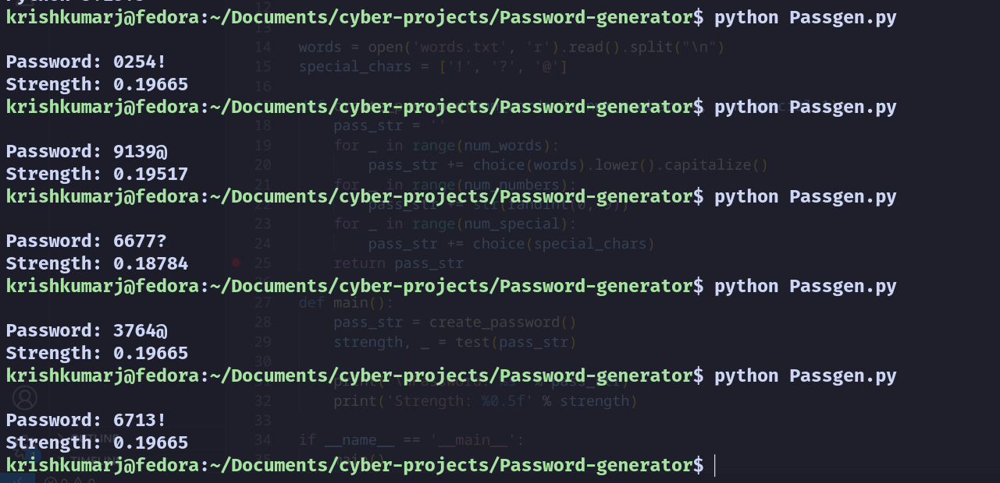

# Password Generator (Python)

This is a simple Python project that generates secure, random passwords. It combines English words, numbers, and special characters to create a strong password. It also checks how strong your password is using the `passwordmeter` library.

## Sample Output

You can see examples of the generated passwords and their strength in the screenshots below:

- 


## Features

- Automatically downloads a list of English words if it's not already available.
- Combines random words, numbers, and symbols to form a password.
- Uses the `passwordmeter` library to evaluate the strength of the password.

## Requirements

- Python 3 installed on your system
- `passwordmeter` library

To install the required library, run:

```bash
pip install passwordmeter
